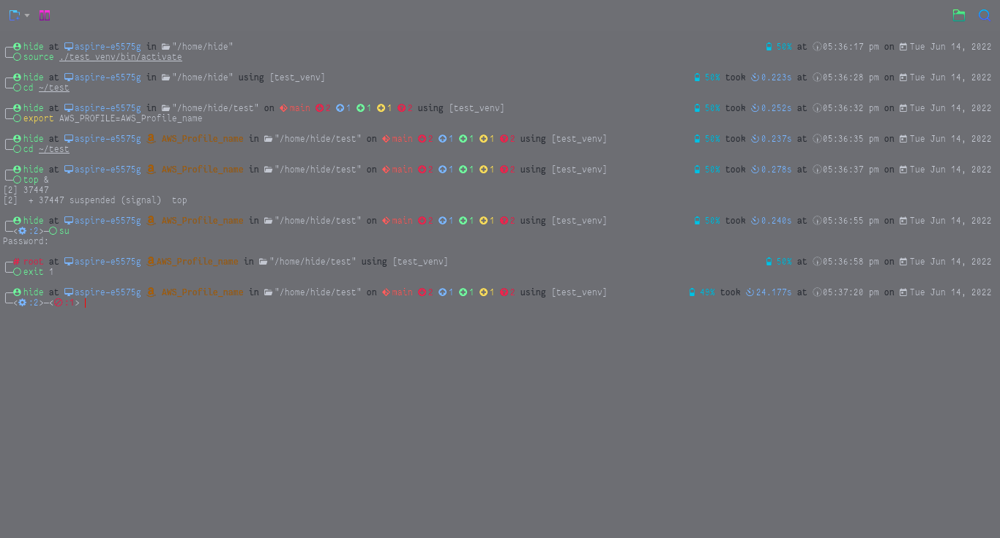
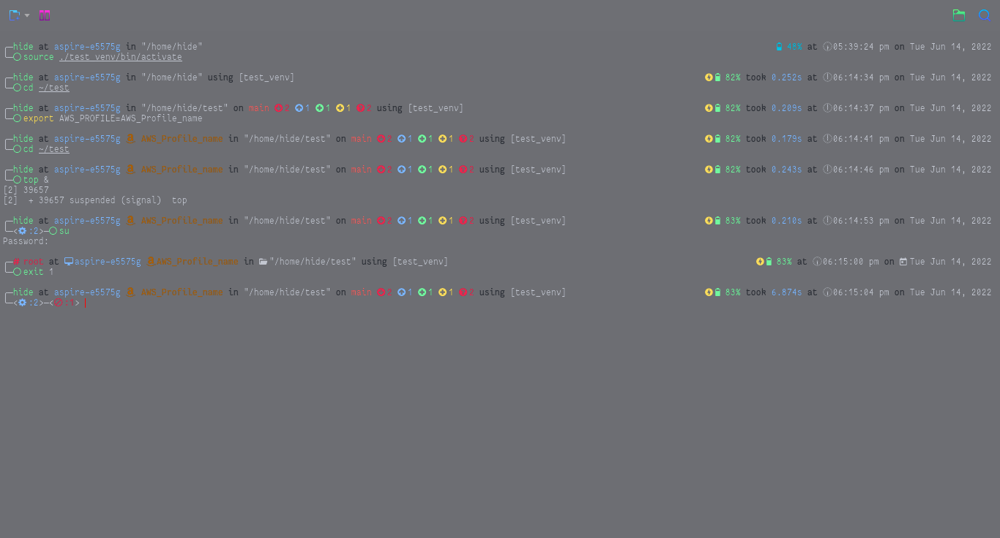

# acenoster.zsh-theme

A multipurpose ZSH theme.

**Example prompt when at home directory:**


**Example showing all information possible in a single prompt:**


# Compatibility

You will need to install any one [Nerd font](https://www.nerdfonts.com/font-downloads) and use it in your terminal for this theme to render the icons correctly.

## What does it show?

The following tables show which information are shown in the prompt in sequential order.

* \* denotes visible only when applicable.
* The corresponding oh-my-zsh plugin needs to be enabled in order for its info to be shown.
* To disable an info, either disable its corresponding oh-my-zsh plugin, set its corresponding toggle variable to `0` or unset its corresponding format specifier variable.
* The default values of toggle and format specifier variables with additional information are given [further down](#info-toggles-set-to-0-for-off-1-for-on).

### Left pre prompt:

<table>
  <tr>
    <th>Info</th>
    <th>oh-my-zsh plugin</th>
    <th>Toggle variable</th>
    <th>Format specifier variable</th>
  </tr>
  <tr>
    <td>Username</td>
    <td></td>
    <td>ZSH_THEME_ACENOSTER_ALWAYS_SHOW_USER</td>
    <td>ZSH_THEME_ACENOSTER_USER_PROMPT_FORMAT</td>
  </tr>
  <tr>
    <td>Hostname</td>
    <td></td>
    <td>ZSH_THEME_ACENOSTER_ALWAYS_SHOW_HOST</td>
    <td>ZSH_THEME_ACENOSTER_HOST_PROMPT_FORMAT</td>
  </tr>
  <tr>
    <td>*AWS profile name</td>
    <td>aws</td>
    <td></td>
    <td></td>
  </tr>
  <tr>
    <td>Current working directory</td>
    <td></td>
    <td></td>
    <td>ZSH_THEME_ACENOSTER_DIR_PROMPT_FORMAT</td>
  </tr>
  <tr>
    <td>*git branch, tracking and local status</td>
    <td>git-prompt</td>
    <td></td>
    <td></td>
  </tr>
  <tr>
    <td>*Mercurial branch, tracking and local status</td>
    <td></td>
    <td>ZSH_THEME_ACENOSTER_SHOW_HG_PROMPT</td>
    <td></td>
  </tr>
  <tr>
    <td>*Virtual environment name</td>
    <td>virtualenv</td>
    <td></td>
    <td></td>
  </tr>
</table>

### Right pre prompt:

<table>
  <tr>
    <th>Info</th>
    <th>oh-my-zsh plugin</th>
    <th>Toggle variable</th>
    <th>Format specifier variable</th>
  </tr>
  <tr>
    <td>*Battery percentage and status</td>
    <td></td>
    <td>ZSH_THEME_ACENOSTER_SHOW_BATTERY</td>
    <td></td>
  </tr>
  <tr>
    <td>*Last command execution time</td>
    <td></td>
    <td>ZSH_THEME_ACENOSTER_SHOW_TIMER</td>
    <td></td>
  </tr>
  <tr>
    <td>Emoji clock</td>
    <td>emoji-clock</td>
    <td></td>
    <td></td>
  </tr>
  <tr>
    <td>Digital clock</td>
    <td></td>
    <td></td>
    <td>ZSH_THEME_ACENOSTER_CLOCK_PROMPT_TIME_FORMAT</td>
  </tr>
  <tr>
    <td>Calendar</td>
    <td></td>
    <td></td>
    <td>ZSH_THEME_ACENOSTER_CALENDAR_PROMPT_DATE_FORMAT</td>
  </tr>
</table>

### Left Prompt:

<table>
  <tr>
    <th>Info</th>
  </tr>
  <tr>
    <td>*Number of background processes</td>
  </tr>
  <tr>
    <td>*Last command error code</td>
  </tr>
</table>

## Environment variables:

Below are the default values of environment variables used by this prompt. To customize any of them, unset or set a new value in the `~/.zshrc` file.

### Info Toggles:  Set to `0` for off, `1` for on.

```
  ZSH_THEME_ACENOSTER_ALWAYS_SHOW_USER=1
  ZSH_THEME_ACENOSTER_ALWAYS_SHOW_HOST=1
  ZSH_THEME_ACENOSTER_SHOW_HG_PROMPT=1
  ZSH_THEME_ACENOSTER_SHOW_BATTERY=1
  ZSH_THEME_ACENOSTER_SHOW_TIMER=1
```

* See [this](#what-does-it-show) to know which is what.
* Turning off `ZSH_THEME_ACENOSTER_ALWAYS_SHOW_USER` which is on by default will hide the user name unless it is root or in an SSH shell.
* Turning off `ZSH_THEME_ACENOSTER_ALWAYS_SHOW_HOST` which is on by default will hide the host name unless it is in an SSH shell.
* Turning off `ZSH_THEME_ACENOSTER_SHOW_HG_PROMPT` which is on by default will disable the [mercurial](https://www.mercurial-scm.org/) info of the prompt. Mercurial is a SCM (Source Control Management) tool just like git. Although not as popular as git, it is still used in many projects.
* `ZSH_THEME_ACENOSTER_SHOW_BATTERY` which is on by default is the toggle for the battery capacity icon and percentage in the prompt.
* `ZSH_THEME_ACENOSTER_SHOW_TIMER` which is on by default is the toggle for the timer that shows the time taken by the previous command run in the terminal.

### Info Format specifiers:

```
  ZSH_THEME_ACENOSTER_USER_PROMPT_FORMAT="%n"
  ZSH_THEME_ACENOSTER_HOST_PROMPT_FORMAT="%m"
  ZSH_THEME_ACENOSTER_DIR_PROMPT_FORMAT="\"%d\""
  ZSH_THEME_ACENOSTER_CLOCK_PROMPT_TIME_FORMAT="%I:%M:%S %P"
  ZSH_THEME_ACENOSTER_CALENDAR_PROMPT_DATE_FORMAT="%a %b %d, %Y"
```

* See [this](#what-does-it-show) to know which is what.
* If you don't want to see any of these info in the prompt, then unset the corresponding variable by inserting a line with the command `unset variableName` into the `~/.zshrc` file.

### Settings: Set to `0` to disable, `1` to enable.

```
  ZSH_THEME_ACENOSTER_FLUENT_FLOW=1
  ZSH_THEME_ACENOSTER_LESS_ICONS=0
  ZSH_THEME_ACENOSTER_FOLLOW_COLOR_SCHEME=1
  ZSH_THEME_ACENOSTER_COMPACT=0
```

* Enabling `ZSH_THEME_ACENOSTER_FLUENT_FLOW` which is enabled by default shows the connecting words like `at`, `in`, `took`, `on` etc in a dull color between different parts of the prompt to make them seem connected and unified while not being too intrusive.
* Enabling `ZSH_THEME_ACENOSTER_LESS_ICONS`, which is disabled by default will show only those icons in the prompt that indicate a status.
* Enabling `ZSH_THEME_ACENOSTER_FOLLOW_COLOR_SCHEME` which is enabled by default will make the prompt follow the color scheme set in the terminal app. Otherwise, the colors set in [these](#the-following-will-be-followed-only-if-zshthemeacenosterfollowcolorscheme--0) variables will be followed.
* Enabling `ZSH_THEME_ACENOSTER_COMPACT` which is disabled by default will remove the empty line before every prompt.

### Battery levels:

```
  ZSH_THEME_ACENOSTER_BATTERY_HIGH=80
  ZSH_THEME_ACENOSTER_BATTERY_LOW=40
  ZSH_THEME_ACENOSTER_BATTERY_CRIT=20
```

### Colors:

```
  COLOR_AWS="%{$FG[130]%}"            # Used by the AWS icon and profile name text.
  COLOR_GIT="%{$FG[203]%}"            # Used by the git icon and branch name text.
  COLOR_HG="%{$FG[244]%}"             # Used by the mercurial icon and branch name text.
  COLOR_BATTERY_FULL="%{$FG[040]%}"   # Used by the battery full icon and "100%" text.
```

#### The following will be followed only if `ZSH_THEME_ACENOSTER_FOLLOW_COLOR_SCHEME` is disabled

```
  COLOR_BATTERY_NORMAL="%{$FG[036]%}"
  COLOR_DULL="%{$FG[239]%}"
  COLOR_RED="%{$FG[009]%}"
  COLOR_GREEN="%{$FG[047]%}"
  COLOR_BLUE="%{$FG[051]%}"
  COLOR_YELLOW="%{$FG[226]%}"
```

* `COLOR_BATTERY_NORMAL` is the color used by the battery icon and percentage text when it is between the values of `ZSH_THEME_ACENOSTER_BATTERY_HIGH` and `ZSH_THEME_ACENOSTER_BATTERY_LOW` as set in [Battery levels](#battery-levels) section. This color is cyan when `ZSH_THEME_ACENOSTER_FOLLOW_COLOR_SCHEME` is enabled
* `COLOR_DULL` is the color used by the connecting words like `at`, `in`, `took`, `on` etc shown between different parts of the prompt when `ZSH_THEME_ACENOSTER_FLUENT_FLOW` is enabled as described [here](#settings-set-to-0-to-disable-1-to-enable). This color is black when `ZSH_THEME_ACENOSTER_FOLLOW_COLOR_SCHEME` is enabled
* Other colors are used by several parts of the prompt to indicate different states in general.

## Screenshots:

**Default prompt showing all possible information:**



**Same as above but with `ZSH_THEME_ACENOSTER_LESS_ICONS` turned on:**


